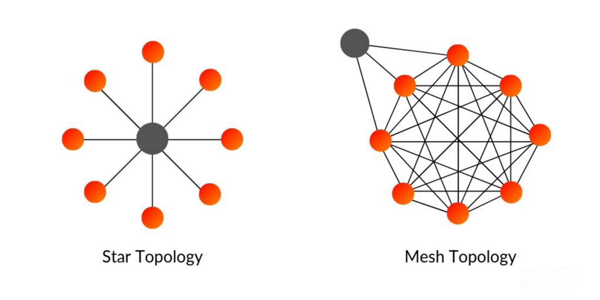
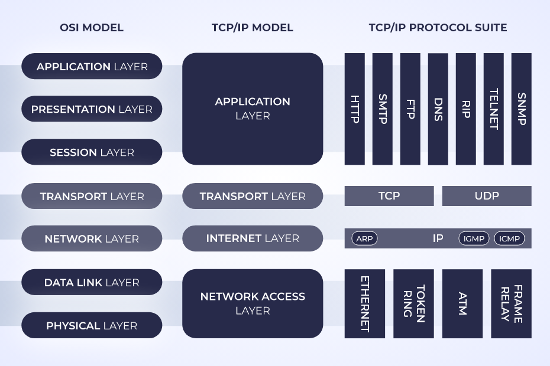

# Explaining Network Topologies

## Network Concepts

Before we dive in, let’s review some key terms used in networking.

### What is a Network?

> A **network** is made up of two or more computer systems that are <mark style="color:yellow;">linked by a transmission</mark>
>
> <mark style="color:yellow;">medium</mark> and <mark style="color:yellow;">share one or more protocols that enable them to exchange data</mark>.&#x20;


Network = Nodes + Links\
\
**Nodes** —> _devices that <mark style="color:yellow;">send</mark>, <mark style="color:yellow;">receive</mark> and <mark style="color:yellow;">forward data</mark>._

**Link** _—> the <mark style="color:yellow;">pathways</mark> between nodes._


### Client-Server VS Peer-to-Peer Networks

We have two types of _**End systems**_ in networks <mark style="color:yellow;">Clients</mark> and <mark style="color:yellow;">Servers</mark>.


**Server —>&#x20;**_**Computers that&#x20;**<mark style="color:yellow;">**serve Clients**</mark>**.**_&#x20;

**Client —>&#x20;**_<mark style="color:yellow;">**Consumes the services**</mark>**&#x20;provided by servers.**_&#x20;


> In **Client-Server** networks there are powerful computers that <mark style="color:yellow;">serve files</mark> to <mark style="color:$success;">Clients</mark>.&#x20;

> A **Peer-to-Peer** network is one that each host acts as <mark style="color:yellow;">both</mark> <mark style="color:green;">Client</mark> and <mark style="color:green;">Server</mark>.

<figure><figcaption></figcaption></figure>

### Network Types

Network is divided into different types based on <mark style="color:yellow;">scope</mark> and <mark style="color:yellow;">size</mark>.


**Scope —>** Number of node&#x73;**.**

**Size —>** Area it covers.


1. **Local Area Network (LAN) :** A network in a <mark style="color:yellow;">short-range</mark> location.
2. **Wide Area Network (WAN) :** A network of networks connected by <mark style="color:yellow;">long-distance links</mark>.

### Network Topologies

The topology describes the **physical or logical structure** of the network in terms of <mark style="color:yellow;">nodes and links</mark>.

1. **Physical Topology:** _A network’s physical topology describes <mark style="color:yellow;">the placement</mark>_ _<mark style="color:yellow;">of nodes</mark> and <mark style="color:yellow;">how they are connected</mark> by the transmission media._
2. **logical topology:** _The logical topology describes <mark style="color:yellow;">the flow of data</mark> through the network._


The simplest topology is the <mark style="color:green;">Point to Point network</mark> (two nodes and the link between).


Two most important topologies on the network are <mark style="color:yellow;">Star</mark> and <mark style="color:yellow;">Mesh</mark>.

<figure><figcaption></figcaption></figure>

***

## OSI Model Concept

The [**International Organization for Standardization**](https://en.wikipedia.org/wiki/International_Organization_for_Standardization) (ISO) developed the [**Open Systems Interconnection (OSI) reference model**](https://en.wikipedia.org/wiki/OSI_model) for better understanding of networ&#x6B;**.**

### Data Encapsulation and Decapsulation

> A **network protocol** is a <mark style="color:yellow;">set of rules for exchanging data</mark> in a structured format.

#### Two principal functions of network protocols:

1. **Addressing** —> _Describing <mark style="color:yellow;">where</mark> data messages should go_.
2. **Encapsulation** —> _Describing how data messages should be <mark style="color:yellow;">packaged for transmission</mark>_.


At **each layer**, for two nodes to communicate they must be running <mark style="color:yellow;">the same protocol</mark>.


_To transmit or receive a communication, on each node, **each layer** provides <mark style="color:yellow;">services for the layer above</mark> and <mark style="color:yellow;">uses the services of the layer below</mark>._

> At each level (except the Physical layer), the sending node adds a <mark style="color:yellow;">header</mark> to the data payload, forming a “**chunk**” of data called a [<mark style="color:green;">**protocol data unit (PDU)**</mark>](https://en.wikipedia.org/wiki/Protocol_data_unit)<mark style="color:green;">.</mark>\
> &#xNAN;**>** _**This is the process of****&#x20;**<mark style="color:yellow;">**encapsulation.**</mark>_

<figure><figcaption></figcaption></figure>

### Layer 1 - Physical

> The Physical layer is responsible for the <mark style="color:yellow;">transmission and receipt</mark> of the **signals that represent bits of data (Symbols)**.


**Signaling** ––> _The process of <mark style="color:yellow;">transmitting and receiving encoded data</mark> over the network medium_. 

A **modulation** scheme describes how electrical, light, or radio signals <mark style="color:yellow;">represent bits</mark>.

**Timing and synchronization** schemes ensure senders and receivers can <mark style="color:yellow;">identify groups of signals as a</mark> <mark style="color:yellow;"></mark><mark style="color:yellow;">**chunk or frame**</mark> <mark style="color:yellow;"></mark><mark style="color:yellow;">of data.</mark>


#### Devices operate at this layer:

* **Transceiver** —> The part of a network interface that <mark style="color:yellow;">sends and receives</mark> signals over the network media.
* **Repeater** —> A device that <mark style="color:yellow;">amplifies</mark> an electronic signal to extend the maximum allowable distance for a media type.
* **Hub** —> A <mark style="color:yellow;">multiport repeater</mark>, deployed as the central point of connection for nodes.
* **Media converter** ––> A device that <mark style="color:yellow;">converts one media signaling type to another</mark>.

### Layer 2 - Data Link Layer

> **Data Link layer** is responsible for <mark style="color:yellow;">transferring data between nodes</mark> on the same logical segment using **hardware addresses**.


A layer 2 segment might include _<mark style="color:yellow;">multiple physical segments</mark>_. This is referred to as a **logical topology**.


#### Devices operate at this layer:

* **Network adapter or network interface card (NIC)** ––> A NIC <mark style="color:yellow;">joins an end system host to network media</mark>.
* **Bridge** ––> joins physical network segments while minimizing the <mark style="color:yellow;">performance reduction of having more nodes</mark> on the same network (separate [<mark style="color:green;">Collision domains</mark>](https://en.wikipedia.org/wiki/Collision_domain)).
* **Switch** ––> An advanced type of <mark style="color:yellow;">bridge with many ports</mark>.&#x20;
* **Wireless access point (AP)** ––> An AP allows nodes with wireless network cards to communicate and <mark style="color:yellow;">creates a bridge between wireless networks and wired ones</mark>.

### Layer 3 - Network

> This layer is responsible for <mark style="color:yellow;">moving data around a network of networks</mark>, known as an **internetwork**.


At layer 3, each packet is given a **destination network address**.\
Routers are configured with information about how to reach these different logical networks.



**Access Control List (ACL) —>** _Firewall that filter at layer 3._&#x20;

A network ACL is a <mark style="color:yellow;">list of the addresses and types of traffic</mark> that are _**permitted or blocked**_.


* _**The main appliance working at layer 3 is the**_ [_<mark style="color:green;">**router**</mark>_](https://en.wikipedia.org/wiki/Router_\(computing\))_**.**_

### Layer 4 - Transport

> This layer is responsible for providing an **end-to-end communication** between applications on different hosts.


One of the functions of the Transport layer is to identify each **type of network application**  by <mark style="color:yellow;">assigning it a</mark> <mark style="color:yellow;"></mark><mark style="color:yellow;">**port number**</mark>**.**


_The upper-layers packets are packaged in layer 4 as **segment**, Each segment is tagged with the application’s **port number.**_


The Transport layer can also implement **reliable data delivery** mechanisms.

**Resend** the lost or damaged packets.


### Upper Layers

#### Layer 5 - Session:

> Most application protocols require the <mark style="color:yellow;">exchange of multiple messages</mark> between the client and server.\
> This exchange of such a sequence of messages is called a _**session or dialog**_**.**

#### Layer 6 - Presentation:

> The **Presentation layer** (layer 6) _<mark style="color:yellow;">transforms</mark>_ data between the format required for the network and the format required for the application.


**For Example**  _Ascii to Unicode_


#### Layer 7 - Application:

> **Application layer** protocols <mark style="color:yellow;">provide an interface for software programs</mark> on network hosts that have established a communications channel through the lower-level protocols to exchange data.
